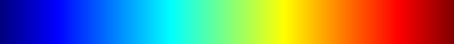

# go-colormap

A library to generate colormaps.  The forward conversion will take a float
between 0 and 1 (inclusive) and convert it to a color map and the reverse
conversion will take RGB values and convert them back to the float.


```
func ExampleRGBUint8() {
  for i := 0; i < 16; i++ {
    rgb := colormap.RGBUint8(float32(i) / 255)
    fmt.Println(rgb)
  }
}
```

```
[127 0 0]
[131 0 0]
[135 0 0]
[139 0 0]
[143 0 0]
[147 0 0]
[151 0 0]
[155 0 0]
[159 0 0]
[163 0 0]
[167 0 0]
[171 0 0]
[175 0 0]
[179 0 0]
[183 0 0]
[187 0 0]
```




```
func ExampleBGRUint8() {
  for i := 0; i < 16; i++ {
    rgb := colormap.BGRUint8(float32(i) / 255)
    fmt.Println(rgb)
  }
}
```

```
[0 0 127]
[0 0 131]
[0 0 135]
[0 0 139]
[0 0 143]
[0 0 147]
[0 0 151]
[0 0 155]
[0 0 159]
[0 0 163]
[0 0 167]
[0 0 171]
[0 0 175]
[0 0 179]
[0 0 183]
[0 0 187]
```
